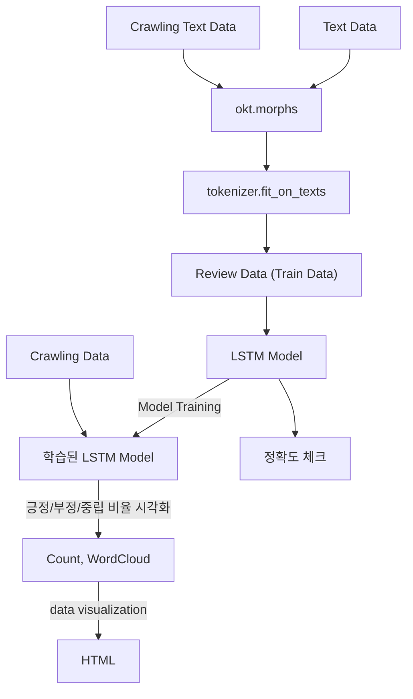
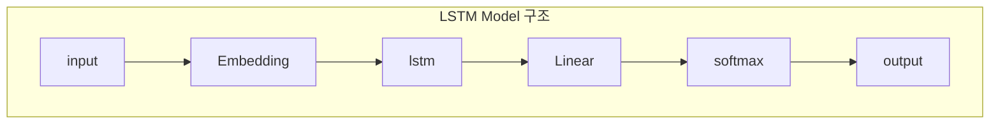

# 🎬 영화 리뷰 감성 분석 프로젝트
---

## 📌 프로젝트 개요
영화 리뷰 데이터를 분석하여 **긍정**, **부정**, **중립**으로 감성을 분류하고, 그 결과를 그래프로 시각화하여 알기 쉽게 보여주는 시스템입니다.  
추가적으로 **워드클라우드**를 통해 주요 키워드의 중요도를 시각적으로 표현했습니다.

- **프로젝트 기간**: 2020.04 ~ 2020.06  
- **사용 기술**: Python, Keras, HTML, Crawling  
- **개발 환경**: Jupyter Notebook  

---
## 🙋‍♂️ 내 기여도

| 역할 | 상세 내용 |
|------|----------|
| **웹크롤링** | HTML Parser를 활용해 리뷰 텍스트 부분만 효율적으로 추출하는 크롤러를 설계 및 구현 |
| **데이터전처리** | 수집된 리뷰 데이터를 분석 가능한 형태로 만들기 위해 데이터 정제 작업을 수행 |
| **감성 분석 모델 (LSTM)** | LSTM 기반 감성 분석 모델을 설계하고 구현 |
| **워드클라우드** | 리뷰 데이터 내 빈번히 등장하는 단어들의 가시성을 높이기 위해 불용어 사전을 별도로 관리하고, 단어별 가중치를 적용하는 알고리즘을 구현 |

---

## 👥 팀 구성 및 역할 분담
- **본인**: 데이터 전처리, LSTM, 웹크롤링, 워드클라우드
- **팀원**: 시각화 HTML페이지제작
- **팀원**: 웹 크롤링

---
## 📂 주요 기능
### 1. 웹 크롤링
- 네이버 영화 리뷰 페이지 전체 크롤링
- HTML Parser를 이용하여 리뷰 텍스트 부분만 추출

### 2. 데이터 전처리
- **데이터 정제**: NULL, 공백, 영어 제거
- **불용어 제거**: 감성 분석에 불필요한 단어 제거
- **토큰화**: `Okt.morphs`를 사용하여 문장을 형태소 단위로 나눔

### 3. 감성 분석 모델 (LSTM)
- **활성 함수**: `Softmax` → 출력값을 확률로 변환
- **로스 함수**: `Categorical Crossentropy` → 분류 모델 최적화
- **옵티마이저**: `RMSprop` → 학습 속도와 안정성 향상

### 4. 워드클라우드
- 리뷰 데이터 전용 **불용어 사전** 구축
- 가중치를 부여하여 많이 언급된 단어의 가시성 강화

---

## 🖼 프로젝트 구조

---

## 📈 학습 결과

- **train_loss** / **val_loss** 변화
- **train_acc** / **val_acc** 변화

---
## 📊 시각화 결과

